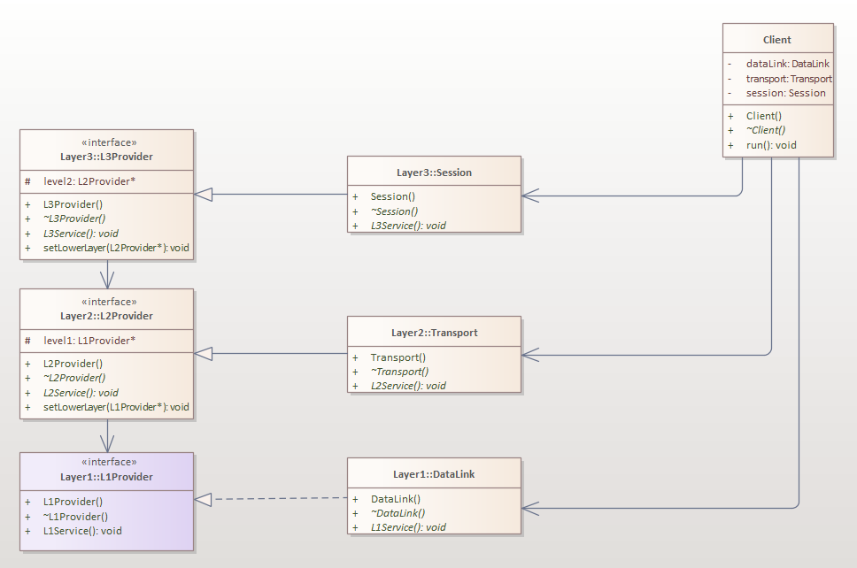
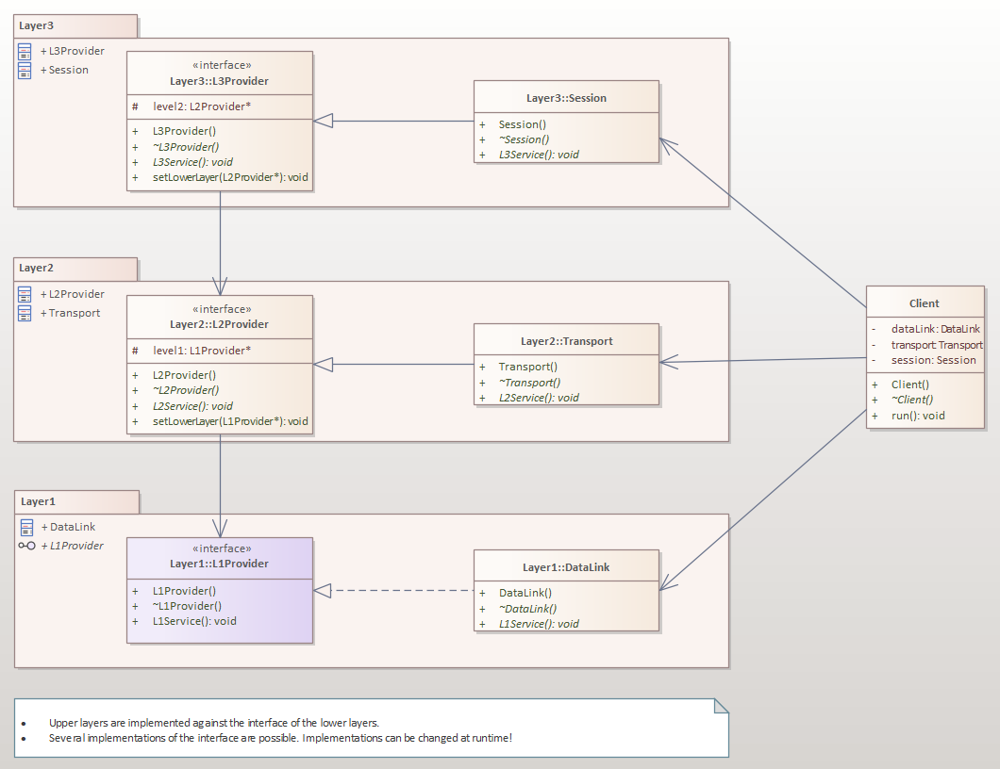

# Layers
## How to build console application
To build an executable file, run the relevant script: StartCMakeOnWindows.bat on Windows, or StartCMakeOnLinux.sh on Linux. The executable file can then be used to run a console application.

## Application description
todo

## Class view

## Package view

