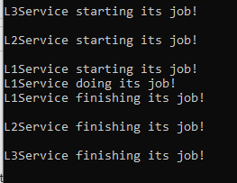

# Layers
## How to build console application
To build an executable file, run the relevant script: StartCMakeOnWindows.bat on Windows, or StartCMakeOnLinux.sh on Linux. The executable file can then be used to run a console application.

## Application description
A synchronous call of services beginning with layer 3 at the top, going through all the layers down, and ending with layer 1 at the bottom. The client calls the service from Layer 3, which then calls the service from Layer 2, which then calls the service from Layer 1, and so on in reverse order.

## Class view

## Package view

