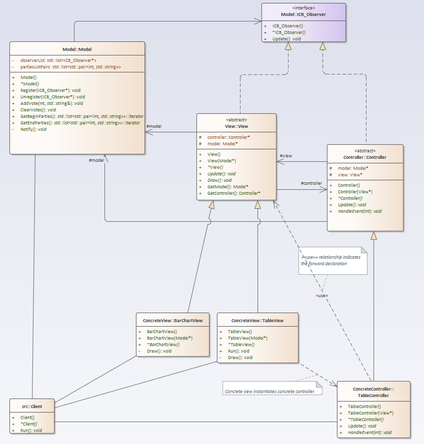
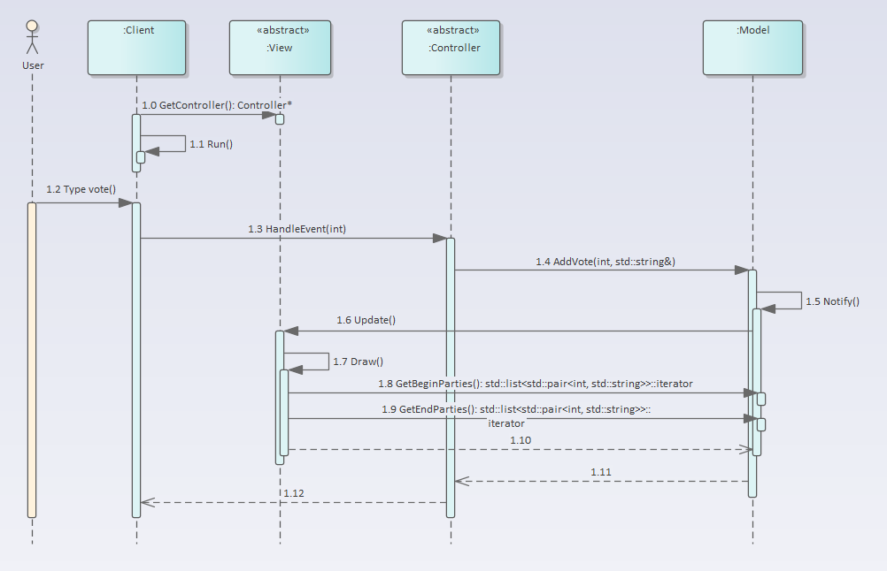

# MVC
## How to build console application
To build an executable file, run the relevant script: StartCMakeOnWindows.bat on Windows, or StartCMakeOnLinux.sh on Linux. The executable file can then be used to run a console application.

## Application description
As it is a console application, there are no visual elements. The views display the model data as a string.
User can vote for Party A, Party B or Party C by entering the corresponding number in the console: 1 for Party A, 2 for Party B and 3 for Party C. Once voting is complete, the bar chart view and table view will display the total votes for all parties.

## Class view
### MVC in general
The self-created UML diagram is similar to the original diagram in the book.

### MVC in detail, including concrete views and controllers
There are two concrete views: the bar chart view and the table view. There is also one concrete controller: the table controller. The bar chart view has no controller.

## Runtime view
### Instantiating
The client instantiates both views: the bar chart view and the table view, as well as the model. The table view then instantiates its table controller. The table controller then receives the model from its view. The views and controller register by the model for notifications. The client then executes the while(1)-loop to get user input and show the views' output.

### Event handling
User input via the console is handled by the table controller. For this reason, the client receives the table controller from the table view. Once the user has entered their vote into the console, the table controller handles this event and updates the data in the model. The model then notifies both views of the data changes. The views then display their output in the console.

